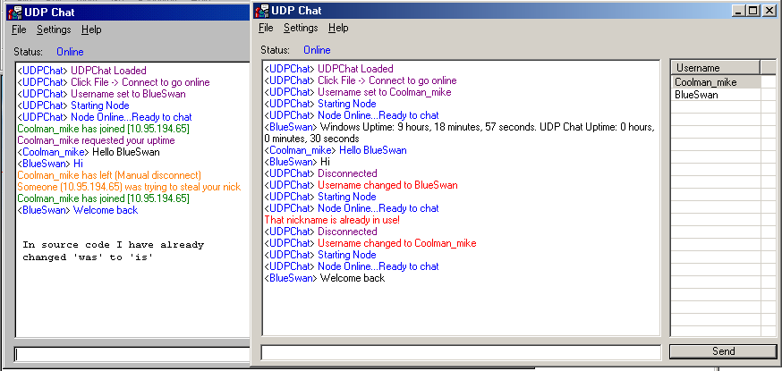



## UDPChat \- Worth Looking at for Everyone

### Description

UDPChat is a very useful server-less chat system for uses on LANs. Not only is it fast and secure,

it also has Ping Timeouts, Uptime Requests, Emote Support, Chat Support, Resizability, Changeable nicknames

and is basically crash-proof and won't display messages from uncompatible clients. The system runs on port

1025 and upon startup Binds to that port on the Network Interface only and also does a broadcast on the same

port, network wide. The protocol is simple but safe, quick but secure ;) Log has colour coding and 2 people

with the same nickname cannot be online at the same time. There is a userlist on the side and the function

to request the uptime of other user(s) Clients + O/S's. Your nickname is stored in one registry entry (and I

DO hate apps that write in the registry but this is just a chat program). The other thing is this should teach

you ALOT about RichTextBox, Winsock + UDP, ListViews, Simple UserControls + Arrays. Please take a look,

Vote if you like (i'd like to be code of the day for this one :)). Oh before you ask 1) The icon is from Waste (DONT

ask where to get it search google) and 2) I got 2 windows in a screenshot by using winVNC (which I used for the

entire testing proccess so it was a bit laggy :)) Enjoy it ;)
 
### More Info
 

             |
---                |---
**Submitted On**   |2003-03-12 21:27:46
**By**             |[Michael D\.](https://github.com/Planet-Source-Code/PSCIndex/blob/master/ByAuthor/michael-d.md)
**Level**          |Intermediate
**User Rating**    |5.0 (55 globes from 11 users)
**Compatibility**  |VB 6\.0
**Category**       |[Complete Applications](https://github.com/Planet-Source-Code/PSCIndex/blob/master/ByCategory/complete-applications__1-27.md)
**World**          |[Visual Basic](https://github.com/Planet-Source-Code/PSCIndex/blob/master/ByWorld/visual-basic.md)
**Archive File**   |[UDPChat\_\-\_1653071022003\.zip](https://github.com/Planet-Source-Code/michael-d-udpchat-worth-looking-at-for-everyone__1-48957/archive/master.zip)

